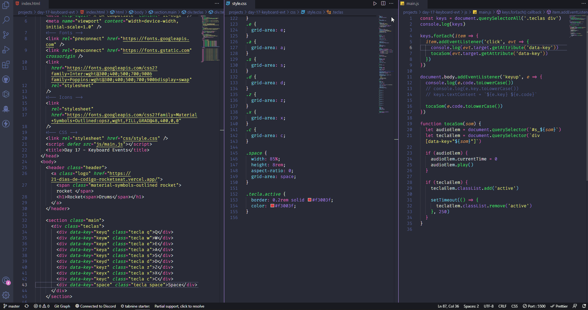

# Seventeenth day - Keyboard Events

## About

Create an web application that captures a key pressed and show it on screen. For this App I choose to create a virtual drum, if you press the marked keys it'll play a specific drum sound

## Demonstration

